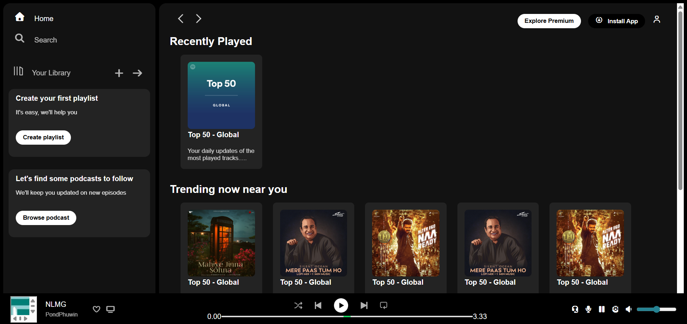

# spotify-ui-clone
A Spotify-inspired web UI clone built using HTML and CSS, focusing on layout, styling, and responsive design. This project will be further improved by adding JavaScript-based interactivity.

## 📷 Preview

## 🚀Tech Stack
-HTML
-CSS

## ✨fEATURES
-Spotify-inspired UI
-Sidebar Navigation
-Music player layout 
